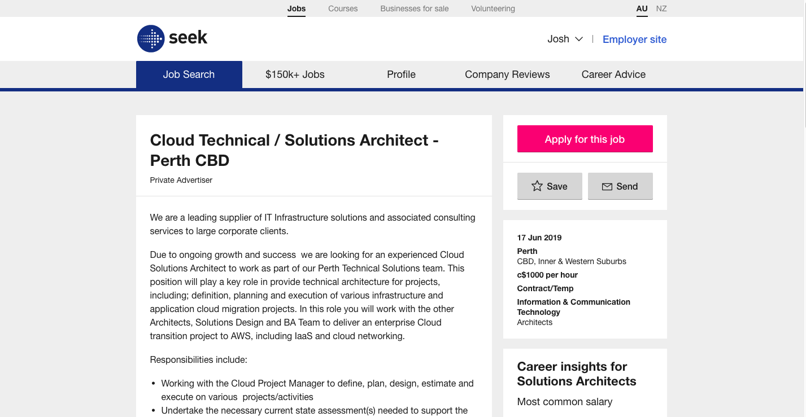
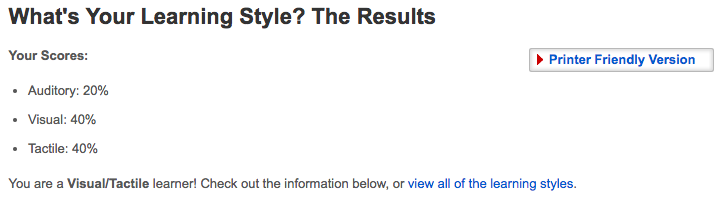
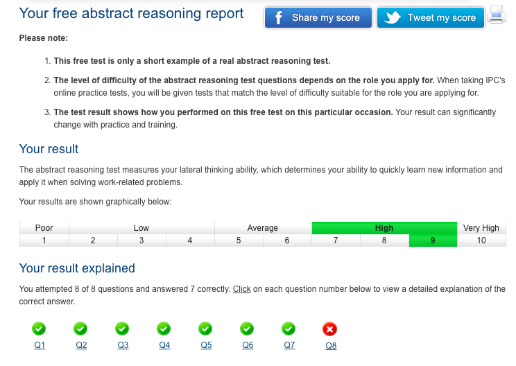

<h1 id="top">Welcome to my RMIT assesment</h1>

Contents

<ul class="toc_list">
  <li><a href="#First_Point_Header">Personal Information</a></li>
<li><a href="#Second_Point_Header">Interest in IT</a></li>
<li><a href="#Third_Point_Header">Ideal Job</a></li>
<li><a href="#Fourth_Point_Header">Personal Profile</a></li>
<li><a href="#Fifth_Point_Header">Project Idea</a></li>
<li><a href="#Sixth_Point_Header">References</a></li>
</ul>

<h2 id="First_Point_Header">Personal Information</h2>

Joshua Misener 
Student Number: s3799261 
<a href="mailto:jmisener@outlook.com">jmisener@outlook.com<a/> 

Australian by birth, Higher School Certificate, speaks English, I spend a lot of time training and honing my martial arts.

<h2 id="Second_Point_Header">Interest in IT</h2>

In short, my interest in IT stems from when I played video games as a child; I chose to come to RMIT because it is a well regarded University with a good online program. 
I expect to learn the basic fundamentals of IT that can be used to segway into something greater later on.
 

<d1>
<dt><strong>You can see what you’re studying</strong></dt>
<dd>A large part of studying information technology is practical. The ability to get hands on. With that, you can change or adjust things and implement what you’ve learned. Assimilating new information and then applying it is both a strength and a hobby.</dd>
 
<dt><strong>The ability to choose</strong></dt>
<dd>The ability to manage and structure your own work schedule is very appealing. The opportunity to work for myself might also present itself. Many information technology professionals have a full-time position at an established company while also running their own business after hours. In this regard I could rapidly increase skill development and greatly reduce skill fade.</dd>
 
<dt><strong>Earn good money</strong></dt>
<dd>Working yourself up the ladder can enable me to earn good money. The acquisition of skills and experience over time will gradually increase my ability to earn, especially if I decided to go into a specialist field.  Information technology professionals e.g. software development manager fall under the top ten highest paying jobs in the world.</dd>
 
<dt><strong>Always in demand</strong></dt>
<dd>There are many choices when specialising in information technology. As technology progresses the need for information technology professionals will only increase. And the better your skill set the more in demand your expertise will be. With jobs being so scarce, the information technology industry continues to show a promising demand trend. Majoring in information technology will expose you to a lot of opportunities and jobs.</dd>
</d1>

<strong>Reasons why I wanted to study at RMIT</strong>
 
<ul>
<li>
I wanted to study at RMIT for three reasons;
<ul>
<li>RMIT is the eighth highest university for employment in Australia.</li>
<li>RMIT is ranked fifth in Australia in universities inder fifty years old.</li>
<li>RMIT has a five star QS ranking for excellence in higher education.</li>
</ul>

<h2 id="Third_Point_Header">Ideal Job</h2>

<a href="https://www.seek.com.au/job/39261970?searchrequesttoken=549b494c-39a0-494f-969b-285172b5c158&type=standard" target="_blank"> Seek.com Job AD</a> (opens in new window)

 

<ul>
<li>A Cloud Architect is a specialist who is responsible for overseeing a company's cloud program. This includes cloud creation, cloud design, management and monitoring. Cloud architects basically oversee the creation and smooth running of a cloud system.</li>
<li>This position is appealing to me because of multiple factors, firstly the ability to lead a team on a sophisticated project, good pay and flexible hours.</li>
<li>The qualifications necessary for this position are way above my own, requiring knowledge of AWS cloud solutions, previous experience and a TOGAF certification.</li>
<li>The skills, experience and or qualifications that I currently hold in regards to this field are almost zero.</li>
<li>From here, I will finish a bachelor of information technology and then continue into specialist study, and hopefully be able to secure an internship along the way.</li>
</ul>

 
<h2 id="Fourth_Point_Header">Personal Profile</h2>

<strong>Myers-Briggs Test</strong>

Personality type: “The Virtuoso” (ISTP-T) 
Individual traits: Introverted – 88%, Observant – 63%, Thinking – 61%, Prospecting – 51%, Turbulent – 61% 
Role: Explorer
Strategy: Constant Improvement  

<strong>Learning Style Test</strong>

 

<strong>Psychometric Test (Abstract Reasoning)</strong>

 

<strong>Reflection on Results</strong>

<ul>
<li>These results indicate to me that I prefer to operate as an individual rather than in a team, and that I like to be able to take something in my hands and play around with it and learn how it works rather than have someone either spell it out or show me how to do it. The final test demonstrates that I can assimilate new information quickly and apply it to new task and or problems.</li> 
<li>My behaviour in a team based in previous experience and these results illustrate the face that I don’t like to be thrown together with just anyone and work from there, I prefer to pick my teammates carefully and build a relationship slowly eventually becoming tight nit. I like to look over the work myself and can make a habit of taking too much work on board and not delegating enough tasks out to team members. In regards to working on a project as a team, my strengths would be intricate problems require constant effort and improvement and my shortfall would be communication.</li>  
<li>When forming a team, balance and like-mindedness in regards to work ethic and ideals is a key component to success. Working with people who are content to give a little space and stay away from the micro management style would be an excellent start, but also keeping in mind that communication is key, I personally tend to be lacking in this regard, which can come off as cold and uncaring if not kept in check. In conclusion, formation of a team requires some thought before slapping a bunch of people together and expecting it to solve itself, but through good communication and constant self improvement the group would be able to successfully complete whatever project was assigned to them, with regards to applicable skills and experience.</li> 
</ul>

<h2 id="Fifth_Point_Header">Project Idea</h2>

<strong>Project Unseen Aid</strong>
 

<strong>Overview</strong>
 

<ul>
<li>
An application of one or Raspberry Pi Zero units, designed to fit in an object the size of a tennis ball (and used as a grenade), with accompanying software to activate mobile phones attached to improvised explosive devices, which will then either be detected and defused by EW and CE teams, or for remote detonation if support units are unavailable. In theory it is to be thrown and then activated by an operator nearby and an additional feature that is highly desired is the ability to ping metal objects in the immediate vicinity, but this is not feasible at this point due to immediate interference of operator and bystander equipment, vehicles and any metal deposits underfoot that may give a false reading.
</li>
</ul>

<strong>Motivation</strong>
 

<ul>
<li>
As of 5 August 2018, there have been 3,458 coalition deaths in Afghanistan as part of ongoing coalition operations since the invasion in 2001. 
In 2009, there were 7,228 improvised explosive device (IED) attacks in Afghanistan, a 120% increase over 2008, and a record for the war. Of the 512 foreign soldiers killed in 2009, 448 were killed in action. 280 of those were killed by IEDs. In 2010, IED attacks in Afghanistan wounded 3,366 U.S. soldiers, which is nearly 60% of the total IED-wounded since the start of the war. Of the 711 foreign soldiers killed in 2010, 630 were killed in action. 368 of those were killed by IEDs, which is around 36% of the total IED-killed since the start of the war to date. Insurgents planted 14,661 IEDs in 2010, a 62% increase over the previous year. 
The Australian forces in Afghanistan have suffered 41 fatalities. 261 soldiers have been wounded. At least 18 of these deaths were from improvised explosive devices or mines.</li> 
<li>As of 5 August 2018, there have been 3,458 coalition deaths in Afghanistan as part of ongoing coalition operations since the invasion in 2001. 
In 2009, there were 7,228 improvised explosive device (IED) attacks in Afghanistan, a 120% increase over 2008, and a record for the war. Of the 512 foreign soldiers killed in 2009, 448 were killed in action. 280 of those were killed by IEDs. In 2010, IED attacks in Afghanistan wounded 3,366 U.S. soldiers, which is nearly 60% of the total IED-wounded since the start of the war. Of the 711 foreign soldiers killed in 2010, 630 were killed in action. 368 of those were killed by IEDs, which is around 36% of the total IED-killed since the start of the war to date. Insurgents planted 14,661 IEDs in 2010, a 62% increase over the previous year. 
The Australian forces in Afghanistan have suffered 41 fatalities. 261 soldiers have been wounded. At least 18 of these deaths were from improvised explosive devices or mines.
</li>
</ul>

<strong>Description</strong>
 

<ul>
<li>
Using raspberry pi zero units, which are smaller than the other variants being 65x30 mm in size making it ideal to mount in a small grenade sized object and then compounding it with a software such as Lost android, <a href="https://play.google.com/store/apps/details?id=com.androidlost" target="_blank"> Android lost GooglePlayStore</a> (opens in new window) activating mobile phones in a controlled area e.g. one or ½ grid squares (1km2) specifically for D-files (A choke point on a road or on terrain) where IEDs are commonly planted. The device is designed to surpass the currently used F3 Mine Detector, whose slow speed of clearing can lead to units rushing to meet timings and not doing a full clearance leading to casualties.</li> 
 
<li>The device would ping mobile phones and switch them on to be detected by electronic warfare teams to then be marked and either defused or controlled detonated.</li>
 
<li>Raspberry Pi Zero components are cheap, going for $25 a unit, making the device disposable if caught in a blast.</li>
 
<li>In detail, the device would be a sphere the size of a tennis ball, with the Zero hardware mounted inside and the software loaded onto the operating system through the micro USB port, which would then be activated by either a switch or a pin on the outside of the sphere, and then thrown up to 20-30m. The device outputs a signal after a 3 second delay, to prevent premature detonation of any unknown nearby IEDs allowing for the operator to take cover in the event of detonation.</li>
 
<li>Theoretically the device would pulse a signal in a 360o radius switching on mobile devices in the area allowing for a scan by EW to locate any devices that are not detonated.</li>
 
<li>It would be a cheaper, faster and safer option with more flexibility in regards to e.g. having a natural creek line running under a road resulting in a choke point, which is difficult terrain to sweep, deploy the device into area to clear D-file for vehicles and/or dismounted troops. A highly desired additional feature would be to ping metal in a controlled area which would make the F3 Mine Detector obsolete, but is not feasible at this stage.
</li>
</ul>

<strong>Tools and Technology</strong>
 

<ul>
<li>
<ins>Raspberry Pi Zero;</ins> 
<ins>Technical specifications</ins> 
The Raspberry Pi Zero is half the size of a Model A+ 
1GHz single-core CPU 
512MB RAM 
Mini HDMI port 
Micro USB OTG port 
Micro USB power 
HAT-compatible 40-pin header 
Composite video and reset headers 
CSI camera connector (v1.3 only) 
</li>
 
<li>

<ins>Open Source Software</ins> 
Lost Android <a href="https://play.google.com/store/apps/details?id=com.androidlost" target="_blank"> Android lost GooglePlayStore</a> (opens in new window) 
</li>
<li>
BlurSpy
</li>
</ul>

<strong>Skills Required</strong>
 

<ul>
<li>
The skills required for this theoretical project are software developer and engineer skills with experience tweaking software, as additional software will need to be written to make this idea functional. Using software such as Lost Android as a base or template software could be re-engineered or developed to fit the need of this project. Obtaining the hardware and personnel with the skill required would be one of the easier tasks of this project, with the software R&D being the most difficult.
</li>
</ul>

<strong>Outcome</strong>
 

<ul>
<li>
In the event that the project is successful, the F3 Mine Detector would be almost but not quite made obsolete it would reduce its use but would not completely replace it, as it runs on the premise that the explosive device runs off a remote detonator. A compromise would be to use both in conjunction with one another. 
</li>
 
<li>
If this project is successful to the desired level outlined in the description, it would have a severe impact in reducing casualties in combat by IED strikes; as such the consequences of this project would be exceedingly positive.
</li>
</ul>

<h2 id="Sixth_Point_Header">References</h2>

<ul>
<li>
16Personalities. (2019). Introduction | Virtuoso Personality (ISTP-A / ISTP-T) | 16Personalities. [online] Available at: https://www.16personalities.com/istp-personality [Accessed 22 Jun. 2019].
</li> 
<li>
En.wikipedia.org. (2019). Coalition casualties in Afghanistan. [online] Available at: https://en.wikipedia.org/wiki/Coalition_casualties_in_Afghanistan#Australian [Accessed 22 Jun. 2019].
</li> 
<li>
Klosowski, T. (2015). The Raspberry Pi Zero Is A $19 Computer The Size Of A Stick Of Gum. [online] Lifehacker Australia. Available at: https://www.lifehacker.com.au/2015/11/the-raspberry-pi-zero-is-a-5-computer-the-size-of-a-stick-of-gum/ [Accessed 22 Jun. 2019].
</li> 
<li>
Play.google.com. (2019). [online] Available at: https://play.google.com/store/apps/details?id=com.androidlost [Accessed 22 Jun. 2019].
</li> 
<li>
Psychometricinstitute.com.au. (2019). Report. [online] Available at: https://www.psychometricinstitute.com.au/report-free.asp?ctid=9520329 [Accessed 22 Jun. 2019].
</li> 
<li>
Raspberrypi.org. (2019). [online] Available at: https://www.raspberrypi.org/products/raspberry-pi-zero/ [Accessed 22 Jun. 2019].
</li> 
<li>
SEEK. (2019). [online] Available at: https://www.seek.com.au/job/39261970?searchrequesttoken=549b494c-39a0-494f-969b-285172b5c158&type=standard [Accessed 21 Jun. 2019].
</li> 
<li>
SHEEHY, M. (2017). What exactly is a Cloud Architect and how do you become one?. [online] Cloud Academy. Available at: https://cloudacademy.com/blog/what-exactly-is-a-cloud-architect-and-how-do-you-become-one/ [Accessed 21 Jun. 2019].
</li> 
<li>
Sophia, M. and Jackie, L. (2019). How to Turn on Android Microphone Remotely with android spy. [online] BlurSPY. Available at: https://www.blurspy.com/how-to-remotely-turn-on-cell-phone-mic/ [Accessed 22 Jun. 2019].
</li> 
<li>
Wallen, J. (2014). Remotely control your Android via internet or SMS with Android Lost. [online] TechRepublic. Available at: https://www.techrepublic.com/article/remotely-control-your-android-via-internet-or-sms-with-android-lost/ [Accessed 22 Jun. 2019].
En.wikipedia.org. (2019). Antenna (radio). [online] Available at: https://en.wikipedia.org/wiki/Antenna_(radio) [Accessed 22 Jun. 2019].
Newatlas.com. (2019). World's smallest TV antenna gets the job done. [online] Available at: https://newatlas.com/worlds-smallest-tv-antenna/42558/ [Accessed 22 Jun. 2019].
</li>
<li>
guidance, C. (2019). Top 5 reasons to study information technology - Student Brands. [online] Student Brands. Available at: https://www.studentbrands.co.za/employment/career-guidance/top-5-reasons-study-information-technology/ [Accessed 23 Jun. 2019].
</li>
</ul>

<a href="#top">Back to top</a>

### Link to Base Document

  <ul>
    <li><a href="Assesment_task_1_IT.docx">Assesment 1</a></li>
    </ul>
    

    
